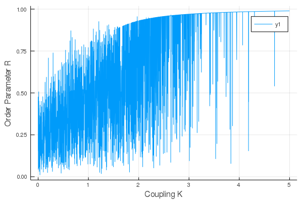
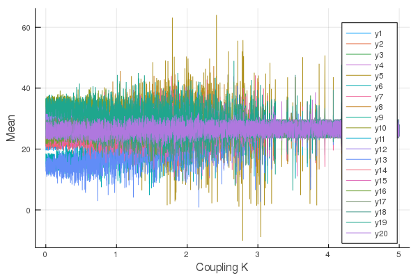
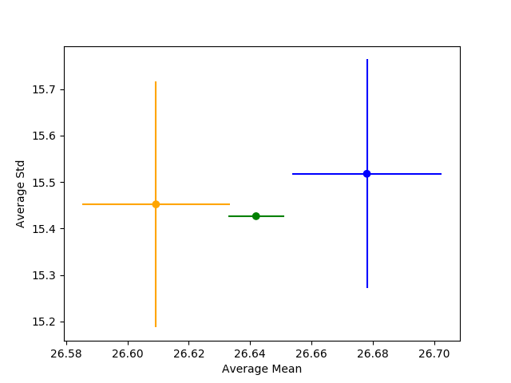
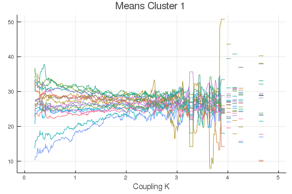
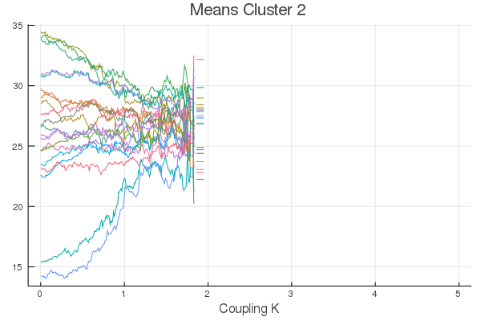
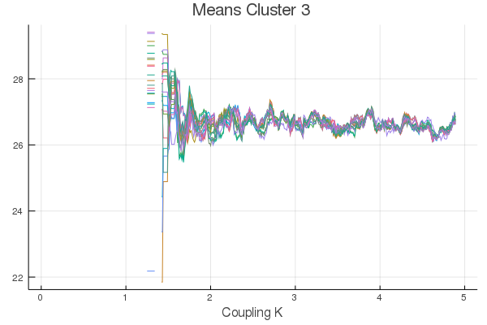
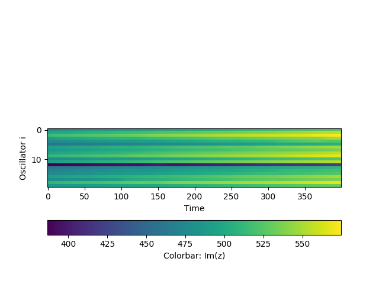
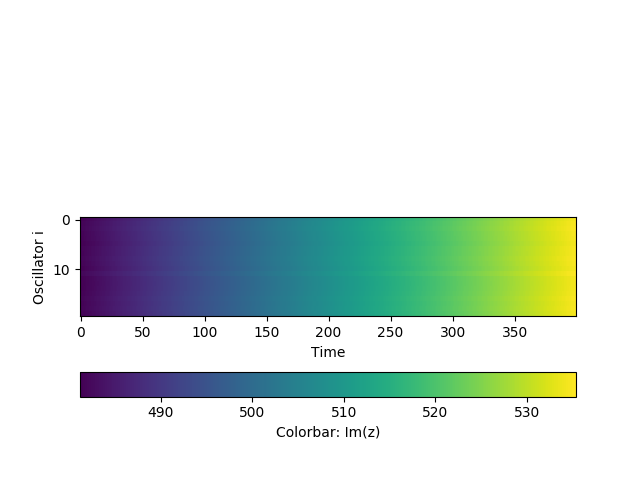
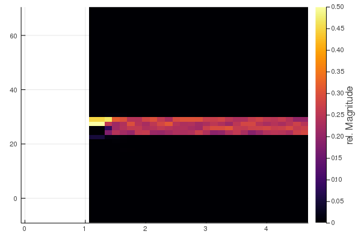
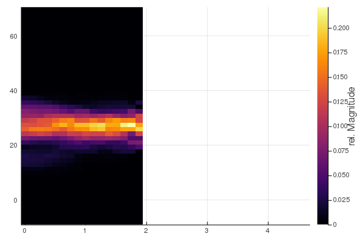

# Introspective Features

This page showcases introspective features of the libary.

The example are First Order Kuramoto Oscillators with ``\mathcal{N}(0.5,0.2)`` distributed eigenfrequencies on a Erdos Renyi random network. Subsequently the coupling is increased as the free parameter. The basic setup is identical to the previous section.

```julia
using MCBB
using LightGraphs
using Clustering
using DifferentialEquations
using Distributions
using StatsBase
import PyPlot
using Plots
```

```julia
N = 20
K = 0.5
nd = Normal(0.5, 0.2)
w_i_par = rand(nd,N)

net = erdos_renyi(N, 0.25)
A = adjacency_matrix(net)

ic = zeros(N)
ic_dist = Uniform(-pi,pi)
kdist = Uniform(0,5)
ic_ranges = ()->rand(ic_dist)
N_ics = 6000
K_range = (i)->rand(kdist)
pars = kuramoto_network_parameters(K, w_i_par, N, A)

# base problem
rp = ODEProblem(kuramoto_network, ic, (0.,3000.), pars)

# we also calculate the order parameter, we won't use it for clustering, but we'll use it as a check
function k_order_parameter(u::AbstractArray)
    uend = u[:,end]
    N = length(uend)
    1. /N*sqrt((sum(sin.(uend)))^2+(sum(cos.(uend)))^2)
end

function eval_ode_run_kura(sol, i)
    N_dim = length(sol.prob.u0)
    state_filter = collect(1:N_dim)
    eval_funcs = [empirical_1D_KL_divergence_hist]
    global_eval_funcs = [k_order_parameter]
    eval_ode_run(sol, i, state_filter, eval_funcs, global_eval_funcs, cyclic_setback=true)
end

tail_frac = 0.9 #
ko_mcp = DEMCBBProblem(rp, ic_ranges, N_ics, pars, (:K, K_range), eval_ode_run_kura, tail_frac)
kosol = solve(ko_mcp)
```
The results are sorted by parameter value, [`show_results`](@ref) shows only results within the given parameter range.

[`normalize(sol:DEMCBBSol)`](@ref) normalized the results so that all measures are within the range $[0,1]$.

## Cluster Membership

```julia
D_k = distance_matrix(kosol, ko_mcp, [1.,0.75,0.,0,1.]); # no weight on the order_parameter and kl div
db_eps = 110 # we found that value by scanning manually
db_res = dbscan(D_k,db_eps,4)
cluster_members = cluster_membership(ko_mcp,db_res,0.2,0.05);
plot(cluster_members)
```


## Plot Measures

* plot one of the measures dependend on the parameter with [`get_measure`](@ref) gets the $k$-th measure. In this case the order is [mean, std, kl-div, order parameter]
* get the parameter array with `parameter(prob::BifMCProblem)`
* here we plot the Order Parameter

```julia
plot(parameter(ko_mcp),get_measure(kosol,4))
xlabel("Coupling K")
ylabel("Order Parameter R");
```


Or do this with a sliding window:
```julia
p_wins, R_grid = measure_on_parameter_sliding_window(ko_mcp, kosol, 4, 0.2, 0.05);
plot(p_wins,R_grid[1,1,:])
xlabel("Coupling K")
ylabel("Order Parameter R");
title("Slding Window Order Parameter")
```


Of course we can also get the multidimensional measures

```julia
plot(parameter(ko_mcp),get_measure(kosol,1))
xlabel("Coupling K")
ylabel("Mean");
```


In this plot we already see the onset of the synchronization.

## Cluster Measures

We can restrict this analysis to single clusters as well.

With the methods ['cluster_measure_mean'](@ref) and ['cluster_measure_std'](@ref) get the means and stds of selected measures seperatly for each cluster. We can plot these with an errorbar plot to get an intuition into typical values of these measures for each cluster and how they differ from each other.

```julia
colororder = ["blue","orange","green","red","purple","brown","magenta","olive","cyan"]
measure_1 = 1
measure_2 = 2

m1m = cluster_measure_mean(kosol, db_res, measure_1)
m1sd = cluster_measure_std(kosol, db_res, measure_1)
m2m = cluster_measure_mean(kosol, db_res, measure_2)
m2sd = cluster_measure_std(kosol, db_res, measure_2)

SC = PyPlot.scatter(m1m, m2m, c=colororder[1:length(m1m)])
PyPlot.errorbar(m1m, m2m, fmt="o", ms=0,ecolor=colororder, xerr=0.005*m1sd, yerr=0.1*m2sd)
PyPlot.legend(lp, ("Noise","2","3","4","5","6","7","8","9","10","11"))
PyPlot.xlabel("Average Mean")
PyPlot.ylabel("Average Std")
```



In this case we scaled the error bars, as the Stds of the measures is much larger than the differences in the Average meausres. This is due to the fact that the Kuramoto oscillators are all oscillating relativly fast in this setup. It is important to note that for Cluster 3, the synchronous state, the Stds have a very small Std, meaning that almost all trials in this cluster have the same Std. This is clearly a strong indicator for a synchronous state. Cluster 2 and the noise cluster have only a slightly different average mean and std, if one would decrease the DBSCAN `\epsilon` parameter, they would probably be classified as only one cluster.

The method [`cluster_measures`](@ref) gets the measure for each cluster seperately and applies a sliding window. The routine returns the parameter values of the sliding window, a ``N_{cluster}\times N_{measures}\times N_{dim}\times N_{windows}`` array for measures that are evalauted for every dimension and a ``N_{cluster}\times N_{measures}\times N_{windows}`` for global measures. For windows in which the cluster has no members a `NaN` is returned. This is (in constrast to `missing` or `nothing`) compatible with most plotting routines. We should however always define common x-Limits for the plots because of this. It returns these within a [`ClusterMeasureResult`](@ref) struct that can be plotted easily, as they are plot recipes defined.

```julia
cluster_meas_res = cluster_measures(ko_mcp, kosol, db_res, 0.1, 0.01);
```

```julia
xlim_values = [0, 5]
plot(cluster_meas_res, 1, 1, xlims=xlim_values, title="Means Cluster 1", xlabel="Coupling K")
```




```julia
plot(cluster_meas_res, 1, 2, xlims=xlim_values, title="Means Cluster 2", xlabel="Coupling K")
```



```julia
plot(cluster_meas_res, 1, 3, xlims=xlim_values, title="Means Cluster 2", xlabel="Coupling K")
```


The method [`cluster_means`](@ref) returns the mean value of each measure for each cluster.

```julia
cluster_ms = cluster_means(kosol, db_res);
print("Means of the 3rd cluster: ")
print(cluster_ms[3,1,:])
```
    Means of the 3rd cluster: [29.4609, 29.4524, 29.4574, 29.4589, 29.4585, 29.4609, 29.4593, 29.4607, 31.5164, 29.4558, 27.5155, 29.4559, 29.4578, 29.4578, 29.4576, 29.4582, 31.7665, 29.4609, 29.4653, 29.595]

## Single Trajectories

With the method [`get_trajectory`](@ref) we can get the full trajectory of an example trial within a certain cluster. This can help us get a further impression of the nature of the trajectories inside the cluster.

```julia
IM = PyPlot.imshow(Matrix(get_trajectory(ko_mcp,kosol, db_res,0,only_sol=true)), aspect=4)
PyPlot.ylabel("Oscillator i")
PyPlot.xlabel("Time")
cb = PyPlot.colorbar(IM, orientation="horizontal")
cb[:ax][:set_xlabel]("Colorbar: Im(z)", rotation=0)
```

For the zeroth/Noise cluster we see an unordered system



and for the second cluster we see a synchronized system (except for one oscillator that is disconnected in this particular random network)



## Cluster Measure Histograms

It is also possible to show how the histograms of a measure on a sliding window. [`cluster_measures_sliding_histograms`](@ref) does just that. It returns for each cluster and for each window a histogram of a measure of your choice as a [`ClusterMeasureHistogramResult`](@ref).

```julia
cluster_hist_res = cluster_measures_sliding_histograms(ko_mcp, kosol, db_res, 1, 0.25, 0.125)
plot(cluster_hist_res, 1)
```



For the synchronized state the means are in a narrow band and outside of these band they are no values, while for the unordered cluster the means have a broad distribution.



## Cluster Initial Conditions

[`ClusterICSpaces`](@ref) enables us to analyse which initial conditions lead to the different clusters.
The ``struct`` is constructed with [`ClusterICSpaces`](@ref). Additional parameter bounds can be provided to rescrict the analysis to the specified parameter range. It returns the [`ClusterICSpaces`](@ref)-struct with the fields:
* `data::AbstractArray`: N_cluster long Array of N_dim+1 (+1 for the parameter) Arrays with the ICs/Parameter, e.g. `data[2][1]` for the ICs of IC-dimension 1 that lead to results classified in cluster 2
* `histograms::AbstractArray`: N_cluster long array of of N_dim+1 histograms for each IC/Par dimension and Cluster
* `means::AbstractArray`: means of data
* `stds::AbstractArray`: stds of data

Statistics of the ICs across their dimension. For each run the mean, stds, skew of the ICs used for this run is calculated, These are the distributions of theses statistics for all runs. For example certain clusters/behaviour must be favoured if the ICs are already very close together, thus possessing a small ``std``
* `cross_dim_means::AbstractArray`
* `cross_dim_stds::AbstractArray`
* `cross_dim_skews::AbstractArray`

```julia
cics = ClusterICSpaces(ko_mcp, kosol, db_res; min_par=1, max_par=4);
```

```julia
plt[:hist](cics.cross_dim_stds[1], density=true, alpha=0.5, label="Cluster1")
plt[:hist](cics.cross_dim_stds[2], density=true, alpha=0.5, label="Cluster2")
plt[:hist](cics.cross_dim_stds[3], density=true, alpha=0.5, label="Cluster3")
xlabel("Standard Deviation of all ICs in a run")
ylabel("rel. Magnitude")
legend();
```


This shows the Stds of the ICs for each Cluster.

Next we plot the distributions of each IC dimension for each Cluster.

```julia
ICPlot = 1:6 # which IC dimensions to plot
cics_in = cics
i_cluster = 1 # which cluster to plot

hists = cics_in.histograms[i_cluster]
nbins = length(hists[1].weights)
n_dim = length(ICPlot)
weights = zeros((n_dim,nbins))
edges = zeros((n_dim,nbins+1))
for i=1:n_dim
    weights[i,:] = hists[ICPlot[i]].weights
    edges[i,:] = hists[ICPlot[i]].edges[1]
end

weight_maxima = maximum(weights;dims=2)
hist_range = [minimum(edges),maximum(edges)]
max_weight_maxima = maximum(weight_maxima)
x_locs = 0:(max_weight_maxima+0.05*max_weight_maxima):(sum(weight_maxima)+max_weight_maxima)

centers = (edges[:,1:end-1] .+ edges[:,2:end]) ./ 2
heights = diff(edges, dims=2)

fig, ax = subplots()


for i_hist=1:n_dim
    ax[:barh](centers[i_hist,:], weights[i_hist,:], height=heights[i_hist,:], left=x_locs[i_hist])
end

xlabel("IC Dimensions")
ylabel("IC values")

ax[:set_xticks](x_locs)
ax[:set_xticklabels]([string(i) for i in ICPlot]);
```

