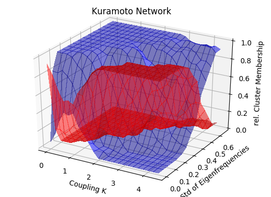
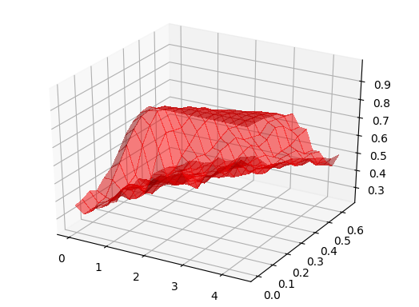

# Multidimensional Parameter Setups

Here, we demonstrate the capabilities of setting up systems with multiple parameters. In this case we investigate 15 first Kuramoto oscillators with their eigenfrequencies normally distributed by ``\mathcal{N}(0.5,\sigma)`` coupled with strength ``K`` on a Erdos Renyi random network. In this experiment, we increase ``\sigma`` and ``K``.


```julia
using Pkg
using MCBB

using LightGraphs
using Clustering
using DifferentialEquations
using Distributions
using StatsBase
using PyPlot
```

```julia
N = 15
K = 0.5
nd = Normal(0.5, 0.2)
w_i_par = rand(nd,N)

net = erdos_renyi(N, 0.25)
A = adjacency_matrix(net)

ic = zeros(N)
ic_dist = Uniform(-pi,pi)
kdist = Uniform(0,5)
ic_ranges = ()->rand(ic_dist)
N_ics = 10000
K_range = (i)->rand(kdist)
std_range = (i)->rand(Uniform(0.0,0.75))

new_kura_par(old_par; K=1, std=0.2) = kuramoto_network_parameters(K, rand(Normal(0.5, std), N), N, A)
par_var = MultiDimParameterVar([OneDimParameterVar(:K,K_range),OneDimParameterVar(:std,std_range)], new_kura_par)    

pars = kuramoto_network_parameters(K, w_i_par, N, A)

# base problem
rp = ODEProblem(kuramoto_network, ic, (0.,3000.), pars)

# we also calculate the order parameter, we won't use it for clustering, but we'll use it as a check
function k_order_parameter(u::AbstractArray)
    uend = u[:,end]
    N = length(uend)
    1. /N*sqrt((sum(sin.(uend)))^2+(sum(cos.(uend)))^2)
end

function eval_ode_run_kura(sol, i)
    (N_dim, __) = size(sol)
    state_filter = collect(1:N_dim)
    eval_funcs = [mean, std]
    eval_ode_run(sol, i, state_filter, eval_funcs, cyclic_setback=true)
end

tail_frac = 0.9 #
ko_mcp = DEMCBBProblem(rp, ic_ranges, N_ics, pars, par_var, eval_ode_run_kura, tail_frac)
kosol = solve(ko_mcp)
```
For multi-parameter setups we need to initialize a instance of [`MultiDimParameterVar`](@ref) manually and define a suitable function that returns new parameter instances, in this case `new_kura_par`. For evaluating the results

```julia
D_k = distance_matrix(kosol, ko_mcp, [1,0.5,1.,1.]); # no weight on the order_parameter and kl div
```

```julia
db_eps = 110 # we found that value by scanning manually
db_res = dbscan(D_k,db_eps,4)
cluster_members = cluster_membership(ko_mcp,db_res,[0.5,0.05],[0.2,0.05]);
```

```julia
ax = subplot(111)
plot_surface(cluster_members[1][:,:,1],cluster_members[1][:,:,2],cluster_members[2][:,:,2],alpha=0.5,antialiased=false,color="red")
plot_surface(cluster_members[1][:,:,1],cluster_members[1][:,:,2],cluster_members[2][:,:,1],alpha=0.5,antialiased=false,color="blue")
xlabel("Coupling K")
ylabel("Std of Eigenfrequencies")
zlabel("rel. Cluster Membership")
title("Kuramoto Network")
```



# Compare to R

```julia
par_mesh, Rslid = measure_on_parameter_sliding_window(ko_mcp, kosol, 4, [0.5,0.05],[0.2,0.05]);
```
```julia
ax = subplot(111)
plot_surface(par_mesh[1,:,:],par_mesh[2,:,:],Rslid[1,1,:,:],alpha=0.5,antialiased=false,color="red")
```



For further analysis [`cluster_measures`](@ref) is also working with multiple parameters. [`ClusterICSpaces`](@ref) does _not_ work (yet) with multiple parameter setups.
